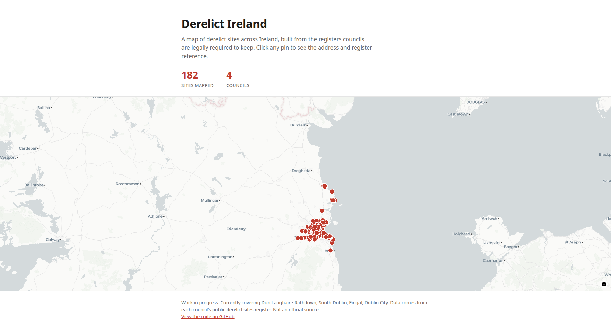

# Derelict Ireland

An interactive map of derelict sites across Ireland, built from the registers that local authorities are legally required to keep.



> Work in progress. **26 of Ireland's 31 local authorities** are covered so far: **2,196 sites mapped**, with a further ~260 held for review. Numbers and features may change.

Under the Derelict Sites Act, every Irish local authority must maintain a public register of derelict sites. Those registers are scattered across dozens of PDFs, spreadsheets, and open-data portals in wildly different formats. This project pulls them into one place, puts every site on a map, and lets you explore, search, and download the data.

Click any pin for the address, council, and register reference. The registers value the mapped sites at roughly **€210 million** in total.

## What the site does

- **Interactive map**: every mapped site as a pin, clustered at low zoom so it stays readable with thousands of points (MapLibre + a clean CARTO basemap).
- **Click a council** in the coverage table to filter the map to just that council's sites, zoom to it, and highlight its boundary.
- **County / local-authority borders** drawn on the map for context.
- **Coverage-by-council table** with mapped / not-yet-mapped / total counts, a coverage bar, the total site **valuation** where the register publishes it, the source, and when each register was last updated.
- **Search** the table by council name, and **sort** any column ascending or descending.
- **Download** the whole dataset, or any single council, as **CSV** (spreadsheets) or **GeoJSON** (mapping tools), generated in the browser with no server needed.

## Coverage

**26 councils published and mapped:** Carlow, Cork City, Cork County, Donegal, Dublin City, Dún Laoghaire-Rathdown, Fingal, Galway City, Kildare, Kilkenny, Laois, Leitrim, Limerick City and County, Louth, Mayo, Meath, Monaghan, Offaly, Roscommon, Sligo, South Dublin, Tipperary, Waterford, Westmeath, Wexford, Wicklow.

**5 councils that keep a register but don't publish it online** (inspection in-office / on request only), shown in the table as "not available online": Kerry, Longford, Cavan, Clare, Galway County.

That accounts for all 31 local authorities.

## How it works

Two parts: an offline **pipeline** that produces the data, and a static **website** that displays it.

### Pipeline (`pipeline/`)

`npm run pipeline` runs every council adapter, geocodes what needs geocoding, and writes:

- `public/sites.geojson`: the mapped sites,
- `public/stats.json`: per-council counts, valuations, sources, and update dates,
- `docs/not-yet-mapped.md`: the addresses still held for review.

Each council has an adapter in `pipeline/adapters/`. Councils publish in two ways:

- **Coordinate-ready** (ArcGIS / open-data layers): coordinates come straight from the council, so sites map precisely with no geocoding. These are marked `council` confidence.
- **Address-only** (PDF / spreadsheet / HTML): the register is first scraped into a committed CSV by a one-off converter in `pipeline/manual/`, then each address is geocoded.

### Geocoding (address-only councils)

Addresses are placed with a tiered, cost-free, terms-of-service-clean approach, using no Google and nothing that forbids storing the coordinates:

1. **Nominatim** (OpenStreetMap) with a per-council county hint.
2. **Photon** (also OpenStreetMap) as a fallback, more tolerant of vague or partial addresses.
3. **Per-county bounding-box check**: any result that lands outside the council's own county is rejected, so a fuzzy match to a same-named street elsewhere never reaches the map.

Results are cached in `data/cache/` so re-runs are fast and free. Photon-derived pins are honestly capped at street/town precision. Anything still unplaced is held for review rather than guessed.

Multi-property register entries (e.g. `6, 8, 10 Main Street`) are split into one site per number before geocoding, so each property is mapped separately.

### Confidence levels

Every pin is tagged with how sure we are of its position: `council` (council-supplied coordinates), `exact` (house-level geocode), `street`, `town`, or `none` (held for review). Current mix: ~1,350 council-precise, 45 exact, 401 street, 400 town.

### A note on personal data

Owner names, owner addresses, and occupier details are **deliberately never read**, even when a source register exposes them. The pipeline only extracts location, reference, dates, and valuation.

## The data

The downloadable CSV / GeoJSON carries: `id, council, address, register_ref, eircode, date_entered, valuation, lat, lon, geocode_confidence, source_url`. Valuations are the market values the registers publish (used for the derelict-sites levy); not every council publishes them, and a total is the sum of the valued sites only.

## Repository layout

```
pipeline/
  adapters/     one file per council -> Site[]
  manual/       one-off converters that scrape a PDF/XLSX/HTML into a committed CSV
  geocode.ts    Nominatim -> Photon -> county-box guard
  run.ts        runs all adapters, splits multi-unit entries, writes outputs
  schema.ts     the Site type and helpers
src/pages/index.astro   the map + coverage table
public/         sites.geojson, stats.json, counties.geojson, logos, served as-is
data/           raw sources, scraped CSVs, and the geocode cache
docs/           screenshot + the not-yet-mapped list
```

## Commands

```sh
npm install        # install dependencies
npm run pipeline   # rebuild the dataset from the registers
npm run dev        # local site at http://localhost:4321
npm run build      # build the production site to ./dist/
```

The website build reads the committed data files and needs no secrets or environment variables.

## Adding a council

1. Write an adapter in `pipeline/adapters/` that returns `Site[]` via `makeSite()`. For address-only councils, add a converter in `pipeline/manual/` first.
2. Add one line to the `ADAPTERS` array in `pipeline/run.ts` (and a county hint / bounding box in `pipeline/geocode.ts` if it needs geocoding).
3. Drop the council's logo into `public/logos/`.
4. Run `npm run pipeline`.

## Deployment

`npm run build` produces a fully static `./dist/`, so it drops onto any static host: Netlify, Cloudflare Pages, or GitHub Pages. No environment variables are needed for the build. The update loop is: run the pipeline locally → commit the regenerated data → push → the host redeploys.

> Note for **GitHub Pages project sites** (served under `/<repo>/`): set `site` and `base` in `astro.config` and prefix the in-page `fetch("/sites.geojson")` / `fetch("/counties.geojson")` calls with the base path, or use a custom domain / root deploy to avoid the base-path handling.

## Built with

[Astro](https://astro.build) &middot; [MapLibre GL JS](https://maplibre.org) &middot; [OpenStreetMap](https://www.openstreetmap.org) (Nominatim + Photon geocoding) &middot; a [CARTO](https://carto.com) basemap &middot; local-authority boundaries from [click_that_hood](https://github.com/codeforgermany/click_that_hood) (ODbL).

## License

The **code** in this repository is released under the [MIT License](LICENSE), so you're free to reuse it as long as you keep the copyright notice.

The **data** is a separate matter. It is aggregated from each local authority's public derelict sites register, and the coordinates are derived from OpenStreetMap geocoding (© OpenStreetMap contributors, [ODbL](https://opendatacommons.org/licenses/odbl/)); the county boundaries drawn on the map are OpenStreetMap-derived too. Treat the dataset as carrying those attribution and share-alike expectations: credit "OpenStreetMap contributors" if you reuse it, and see the disclaimer below.

## Disclaimer

Not an official source. Data comes from each council's public derelict sites register and is provided as-is, with best-effort geocoding. For anything authoritative, consult the council's own register (linked in the coverage table).
