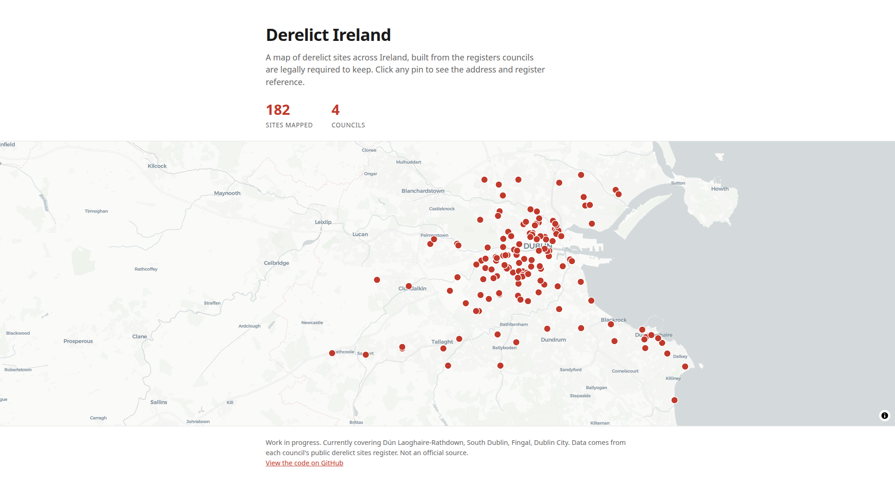

# Derelict Ireland

An interactive map of derelict sites in Ireland, built from public council registers.



> Work in progress. The four Dublin councils are covered so far, and things may change.

Irish councils must keep a register of derelict sites. This project pulls those registers together and puts every site on a map. Click a pin to see the address, council, and register reference.

## How it works

- **Pipeline** (`pipeline/`): downloads each council's register, cleans it into one common format, looks up map coordinates, and writes `public/sites.geojson`.
- **Website** (`src/pages/index.astro`): an Astro page that loads that file and draws the sites on a MapLibre map.

Each council has an adapter in `pipeline/adapters/` (currently the four Dublin councils: Dún Laoghaire-Rathdown, South Dublin, Fingal, and Dublin City). Geocoding uses OpenStreetMap's Nominatim and is cached in `data/cache/`. Adding a council means one new adapter file plus one line in `run.ts`.

## Commands

```sh
npm install        # install dependencies
npm run pipeline   # rebuild public/sites.geojson from the registers
npm run dev        # start the local site at localhost:4321
npm run build      # build the production site to ./dist/
```
